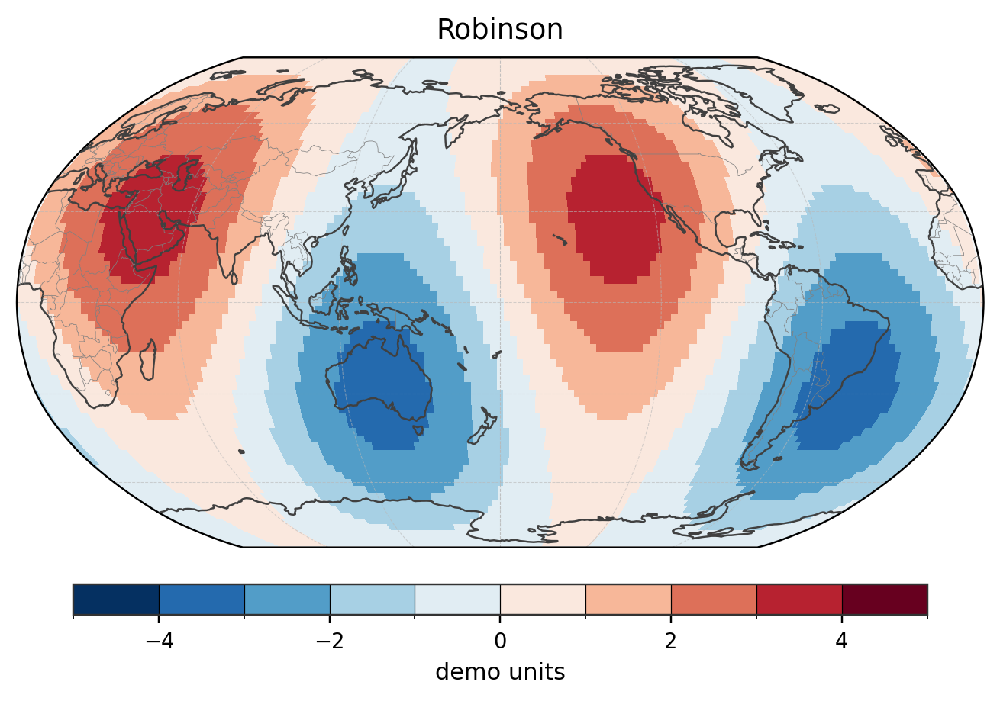

# climara

`climara` is an experimental Python package for climate diagnostics and geoscience plotting.

It is inspired by the concise, resource-based plotting style of NCL, and aims to bring a similar plotting workflow to the Python ecosystem.

The package currently supports both dictionary-style plotting resources and object-oriented plotting workflows.

  

The figure above is a global surface-field example drawn with `climara`.

## Main features

- NCL-style resource dictionaries
- Contour and filled-contour plotting
- Map plotting based on Cartopy
- Multiple map projections
- Panel plots
- Shared labelbars
- Tick label control
- Object-oriented plotting workflow

## Installation

For local development:

    git clone https://github.com/lopooa/climara.git
    cd climara
    python -m pip install -e .

Main dependencies include:

    numpy
    matplotlib
    cartopy

## Quick start

See the example scripts in:

    examples/

Useful examples include:

    examples/demo_19_v031_panel_labelbar_tickmark.py
    examples/demo_20_v032_contour_advanced.py
    examples/demo_22_v033_mapplot_resources.py
    examples/demo_23_v034_projection_gallery.py

## Status

`climara` is still experimental and under active development. APIs may change before a stable release.

Bug reports, suggestions, and examples are welcome.

## License

See the repository license file.

Current version: `v0.1.1`
