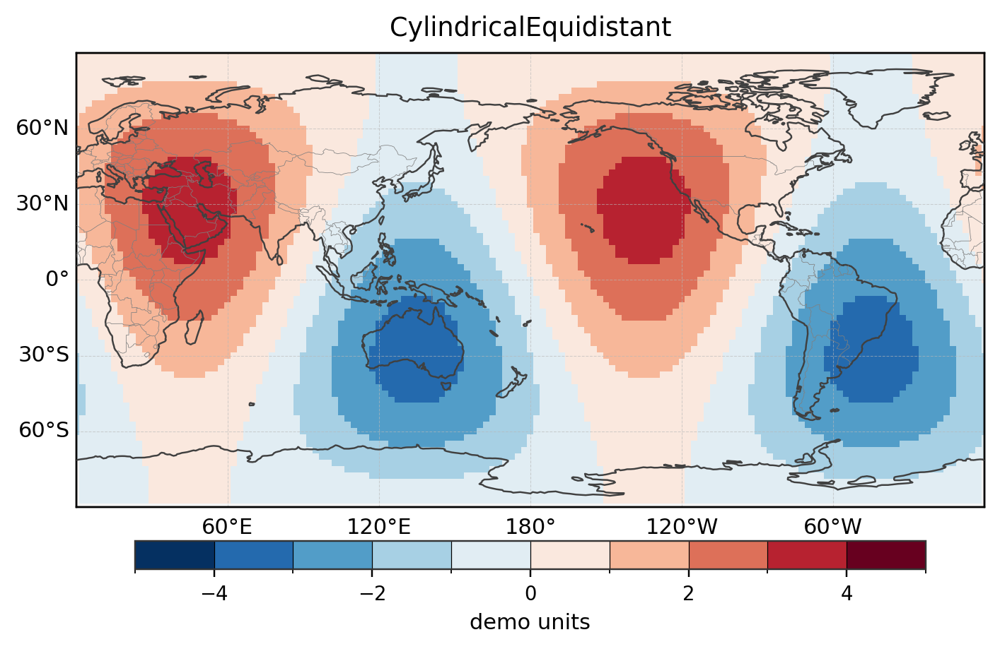

# climara

`climara` is an experimental Python package for climate diagnostics and geoscience plotting.

It is inspired by the concise, resource-based plotting style of NCL, and aims to bring a similar resource-oriented workflow to the Python ecosystem.

The current development branch is focused on a no-Matplotlib graphics core: HLU/GSN-style objects, NDC geometry, SVG primitives, and an SVG backend.



The figure above is an earlier global surface-field example drawn with `climara`.

## Current focus

- No Matplotlib dependency in `src/climara`
- SVG backend for graphics output
- NCL-style resource dictionaries
- HLU-style View / Workstation / Primitive object layers
- LabelBar object, geometry, SVG primitive adapter, and SVG rendering path
- LabelBar title and label TextItem resource semantics
- Guarded behavior for unsupported NCL Plotchar function codes and `NhlDOWN` text direction
- Panel plots and shared labelbars in the SVG backend

## Main features under active development

- Resource-based plotting workflow inspired by NCL
- Object-oriented plotting workflow
- Contour and filled-contour primitives
- Map and grid primitives
- Panel layout
- Shared labelbars
- TextItem metadata preservation in SVG output

## Installation

For local development:

```bash
git clone https://github.com/lopooa/climara.git
cd climara
python -m pip install -e .
```

Main runtime dependencies currently include:

```text
numpy
pandas
xarray
dask
netCDF4
h5netcdf
pyyaml
scipy
```

## Output strategy

The primary graphics backend currently writes SVG.

SVG is vector output. It can later be converted to PDF directly, or rasterized to PNG / TIFF / JPEG at a requested pixel size or print resolution such as 300 dpi or 600 dpi.

## Development status

`climara` is still experimental and under active development. APIs may change before a stable release.

The current no-Matplotlib / SVG backend is not yet a full NCL replacement. In particular, Plotchar parsing, `NhlDOWN` text rendering, TextItem / MultiText bounding boxes, AutoManage, AdjustGeometry, and full Map / TickMark / Contour parity are still under development.

Bug reports, suggestions, and examples are welcome.

## License

See the repository license file.
